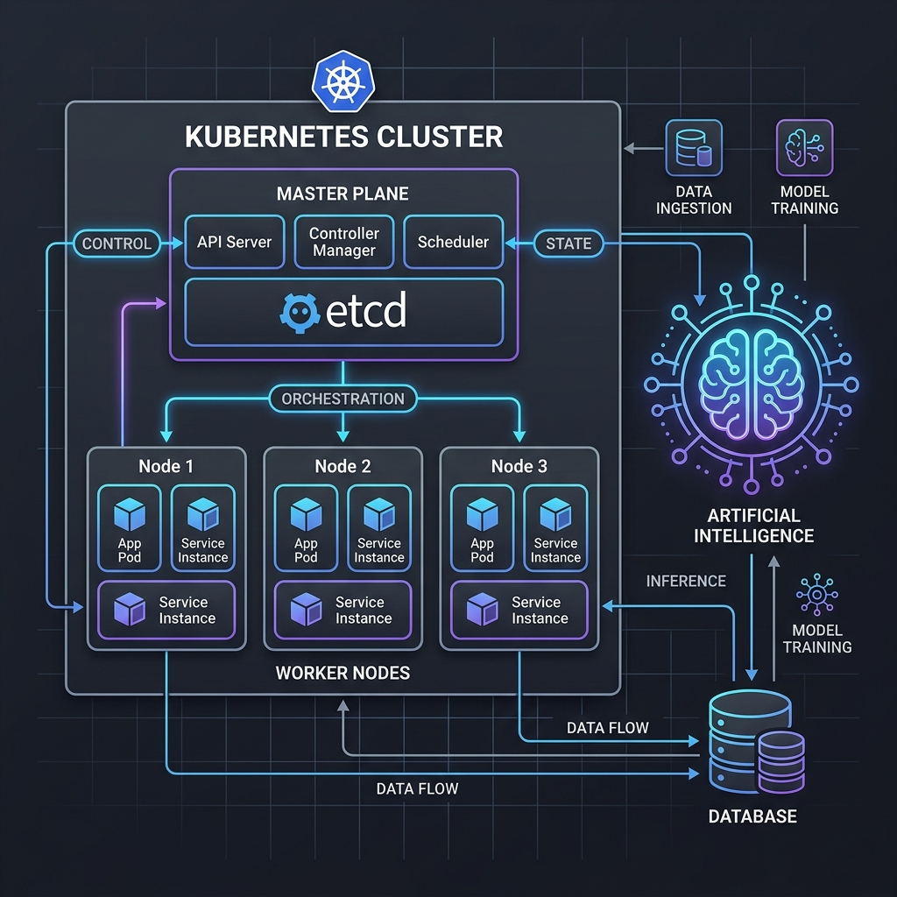

# Morpheus

Morpheus is an intelligent job aggregation and semantic search platform. The application abandons traditional keyword-based search in favor of **Semantic Search (Embedding-based retrieval)** utilizing the .NET 8 ecosystem and PostgreSQL.

## 1. System Architecture

The system is decoupled into three main domains:

- **Morpheus.Api (The "Brain")**: ASP.NET Core 8 API. Responsible for exposing endpoints, orchestrating vectorization via OpenAI (model: `text-embedding-3-small`), managing database persistence, and serving the semantic search.
- **Morpheus.Scraper (The "Muscles")**: Worker Service hosted as a background service. Extracts data via Apify (LinkedIn Scraper Actor), processes the dataset JSON, and submits the data to the API.
- **Morpheus.Shareds (The Domain)**: Shared library project containing Entities (`Job`, `Technology`, `JobTechnology`), Enums, and DTOs, ensuring consistent typing between the Scraper and the API.
- **Morpheus.Web**: Frontend built with Angular (Standalone Components) + TailwindCSS for consuming the API and providing the user interface.

## 2. Technology Stack & Infrastructure

- **Backend**: .NET 8.0, ASP.NET Core
- **Database**: PostgreSQL with the `pgvector` extension
- **Artificial Intelligence**: OpenAI API for embedding generation (1536 dimensions)
- **Data Orchestration**: Apify (LinkedIn Scraper)
- **Frontend**: Angular (Standalone Components) + TailwindCSS
- **Logging**: Serilog (Structured Logging)

## 3. Data Pipeline (Workflow)

1. **Ingestion**: The Worker triggers the Apify Actor via `run-sync-get-dataset-items`.
2. **Deduplication**: The API validates the existence of the job using `ExternalJobId` before any processing.
3. **Vectorization**: The job description is sent to OpenAI; the returned vector is persisted in the `Embedding` column (`vector(1536)` type).
4. **Indexing**: An HNSW index (`hnsw`) with `vector_cosine_ops` is used to ensure semantic search is efficient at scale.
5. **Retrieval**: The endpoint `GET /api/jobs/search` receives a natural language query, vectorizes it, and returns the top-N results ordered by cosine similarity.

## 4. Current Project State

- ✅ **Completed**: Ingestion pipeline, vector database setup, deduplication logic, embedding service, and functional semantic search endpoint.
- 🚧 **In Progress**: Frontend development (Angular + Tailwind) to consume the API.
- 🎯 **Immediate Technical Challenge**: Implementation of UI components (Job Search, Job Cards) and refinement of data mapping from the Apify dataset to the `Job` entity.

## 5. Documentation

For detailed instructions on running, deploying, and testing the application, please refer to the following guides:

- [How to Run](./docs/HOW_TO_RUN.md)
- [Testing Infrastructure](./docs/TESTING.md)
- [Kubernetes Deployment](./docs/KUBERNETES.md)